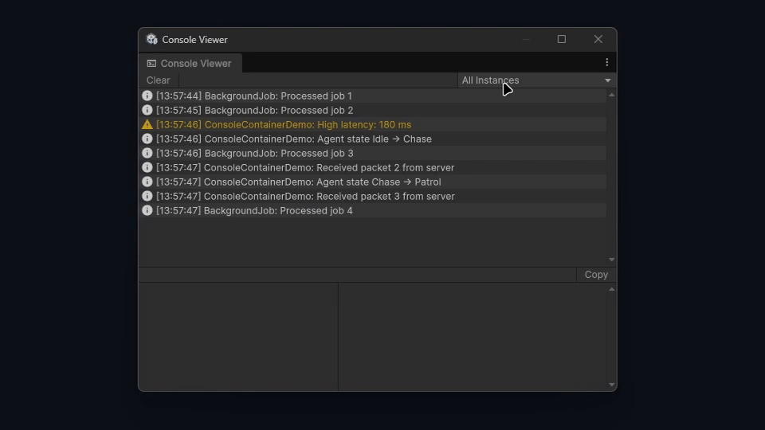

# ConsoleContainer

A lightweight logging container for Unity that keeps your debug output **out of
the Unity Console** and inside dedicated, per-context windows you control.

Instead of dumping every message into one shared console, you create named
**console instances** — one per system, feature, or subsystem — and view them in
a purpose-built editor window. Each message keeps its timestamp, source and full
call stack, and every stack frame is clickable straight into your IDE, exactly
like the built-in Unity Console.



## Why use it instead of the Unity Console?

- **No clutter.** Your gameplay/tooling logs live in their own window, so the
  Unity Console stays reserved for engine warnings, exceptions and third‑party
  noise.
- **Split by context.** Give each system its own instance (`"Networking"`,
  `"AI"`, `"Save System"`, …) and debug one context at a time without filtering
  through everything else.
- **See everything, in order.** The **All Instances** view merges every
  instance's messages into a single chronological stream, so you never lose the
  ordering between systems.
- **Jump to code.** Selecting a message lists its call stack as buttons; each
  one opens the file at the exact line in your external editor.
- **React to what you log.** Every instance raises `MessageCreated` and
  `ErrorCreated`, in the editor *and* in builds, so an error can trigger a soft
  crash screen that shows the reason instead of just sitting in a log. A static
  `Created` event covers every instance at once, including ones built later.
- **Hide it in builds — or don't.** By default nothing reaches a player build.
  An optional settings asset lets you forward messages to `Debug.Log` in builds,
  with an independent toggle per message type.
- **Thread-safe.** Log from jobs, background threads or async code without
  worrying about where the call comes from.

## Installation (UPM)

**Package Manager (git URL)**

1. `Window ▸ Package Manager`
2. `+` ▸ **Add package from git URL…**
3. Enter:

   ```
   https://github.com/reromanlee/ConsoleContainer.git
   ```

**Or edit `Packages/manifest.json` directly**

```json
{
  "dependencies": {
    "com.reromanlee.consolecontainer": "https://github.com/reromanlee/ConsoleContainer.git"
  }
}
```

**Or install locally** by cloning the repository into your project's `Packages/`
folder.

> Requires **Unity 6000.0 (Unity 6)** or newer.

## Quick start

```csharp
using reromanlee.ConsoleContainer;

public class NetworkService
{
    // Name the instance so it shows up in the viewer's dropdown.
    private readonly IConsoleInstance console = new ConsoleInstance("Networking");

    public void Connect(string host)
    {
        console.CreateText(this, "Connecting to", host);
        console.CreateWarning(this, "Latency high:", "180ms");
        console.CreateError("Socket", "Connection refused by", host);
    }
}
```

Open the window from **`Tools ▸ Console Viewer`**.

### Try the sample

In the Package Manager, select ConsoleContainer and import the **Console
Container Demo** sample. Drop `ConsoleContainerDemo` on a GameObject, press
Play, open the viewer, and switch the dropdown between the running instances
(one of which logs from a background thread).

## Logging API

`ConsoleInstance` implements `IConsoleInstance`:

```csharp
void CreateText   (object source, params string[] messageContent);
void CreateText   (string source, params string[] messageContent);
void CreateWarning(object source, params string[] messageContent);
void CreateWarning(string source, params string[] messageContent);
void CreateError  (object source, params string[] messageContent);
void CreateError  (string source, params string[] messageContent);
```

Every message is composed the same way — think of it like `console.log` in the
browser, where the first argument names the source:

- **Time** — rendered as `[HH:mm:ss]`.
- **Source** — the `string` you pass, or `source.GetType().Name` for the
  `object` overload.
- **Content** — every `messageContent` element joined with a single space.
- **Label** — the full line shown in the list and details pane:

  ```
  {source}: {content}
  ```

So `console.CreateText(this, "Loaded", "42", "assets")` from a `SaveSystem`
produces:

```
[14:03:11]  SaveSystem: Loaded 42 assets
```

### Other members

```csharp
new ConsoleInstance();              // auto-named "Instance N"
new ConsoleInstance("My Context");  // named for the dropdown

instance.Name;       // the display name
instance.IsDisposed; // true once Dispose has been called
instance.Clear();    // remove this instance's messages
instance.Dispose();  // stop logging and drop event handlers
```

Two instances may share a name — the viewer disambiguates them — so a system is
free to name its instance after itself without coordinating with anything else.

### Dependency injection

`ConsoleInstance` has a parameterless constructor next to the named one, so
containers that construct by convention (VContainer, Zenject, Reflex, …) can
resolve `IConsoleInstance` without being taught how to supply a name:

```csharp
builder.Register<IConsoleInstance, ConsoleInstance>(Lifetime.Singleton);
```

Register a named instance with the container's own factory/instance API when you
want it to show up under a specific name:

```csharp
builder.RegisterInstance<IConsoleInstance>(new ConsoleInstance("Networking"));
```

## Reacting to messages

Every instance raises events as messages are created, so application code can act
on what its systems log. The common case is turning an error into a soft crash
that tells the player (or the QA build) what actually went wrong:

```csharp
IConsoleInstance console = new ConsoleInstance("Networking");

// Errors only.
console.ErrorCreated += message => SoftCrashScreen.Show(message.Label);

// Everything, when you want to filter or forward it yourself.
console.MessageCreated += message => Telemetry.Record(message.Type, message.Label);
```

| Event | Raised for |
| --- | --- |
| `MessageCreated` | Every message, of any type. |
| `ErrorCreated` | `Error` messages only, immediately after `MessageCreated`. |

- **They fire in player builds too**, independent of the settings asset — a
  message that never reaches the Unity log still reaches your handlers.
- **They fire on the thread that logged the message.** If you log from a job or
  background thread, marshal to the main thread before touching the Unity API.
- **A throwing handler cannot break logging.** The exception is reported through
  `Debug.LogException` and the message is stored as usual.
- **`Dispose()` drops every handler**, so a disposed instance can't keep the
  objects its handlers captured alive.

### Covering every instance at once

Subscribing per instance means remembering to do it at each construction site,
and an app that builds consoles in more than one place — a bootstrap scope and a
view scope, say — will eventually add a third and quietly leave it unobserved.
`ConsoleInstance.Created` closes that gap: it is static, so one subscription
reaches every instance the app will ever create, including ones constructed long
afterwards.

```csharp
// Install once, before anything logs. Every console, present and future, is covered.
ConsoleInstance.Created += instance => instance.ErrorCreated += SoftCrashScreen.Show;
```

- **The instance is fully built** by the time handlers run, so subscribing to its
  own events from here is safe.
- **It is raised on the constructing thread**, and a handler that throws is
  reported through `Debug.LogException` without breaking the construction.
- **Subscriptions are static and live as long as the domain does.** A static
  subscriber needs no unsubscribe; one that is not must detach, or it keeps its
  target alive. Where the editor is set to enter play mode without a domain
  reload, unsubscribe before subscribing so a surviving handler is not left
  registered twice.

The `ConsoleMessage` handed to a handler carries `Type`, `Timestamp`, `Source`,
`Content`, `Label` (`"{source}: {content}"`) and — in the editor — `Callstack`.

## The Console Viewer window

| Feature | Behaviour |
| --- | --- |
| **Instance dropdown** | Pick a single instance, or **All Instances** to see every message merged in chronological order. Instances that share a name are numbered (`Networking`, `Networking (2)`) so each stays selectable, and one that ended its life is marked `(disposed)`. |
| **Remembered layout** | Each window keeps its own splitter sizes, selected instance and scroll position across domain reloads and editor restarts. If the instance you were watching is recreated — a new play session, another test run — the view re-attaches to it by name. |
| **Zebra striping** | Alternating rows are subtly highlighted for readability; selection and hover always take priority. |
| **Selection** | Click a message to show its full `{source}: {content}` text in the details pane. |
| **Copy** | Copies the selected message to the system clipboard. |
| **Call stack** | Each frame becomes a button — top button is the log call site, going down the chain — that opens the file at its line in your IDE. |
| **Clear** | Clears the currently selected instance, or **all** of them when *All Instances* is selected. A `(disposed)` instance leaves the dropdown at that point, since it has nothing left to show. |

## Editor vs. player builds

**In the Unity Editor**, messages go to the Console Viewer window. They stay out
of the Unity Console — no `Debug.Log`, no doubled-up output — as long as you log
through a `ConsoleInstance` (calling `Debug.Log` or throwing exceptions yourself
still behaves normally). The one exception is test runs, covered
[below](#showing-messages-in-the-test-runner).

**In a player build**, there is no viewer, so messages are optionally forwarded
to Unity's log based on an optional settings asset:

1. `Assets ▸ Create ▸ ConsoleContainer ▸ Settings`.
2. Move the created `ConsoleContainerSettings` asset into any **`Resources`**
   folder so it ships with the build.
3. Toggle logging **per message type**:

   | Message type | Build output |
   | --- | --- |
   | Text | `Debug.Log("{source}: {content}")` |
   | Warning | `Debug.LogWarning("{source}: {content}")` |
   | Error | `Debug.LogError("{source}: {content}")` |

If **no** settings asset exists in the build, all ConsoleContainer messages stay
hidden. This lets you keep verbose instrumentation in your code and decide, per
project, exactly what (if anything) surfaces in shipped logs.

### Showing messages in the Test Runner

The Test Runner window only lists entries that pass through Unity's log handler,
so messages kept inside the Console Viewer would be invisible while tests run.
The same settings asset therefore has an **Editor logging** section:

| Setting | Meaning |
| --- | --- |
| **Editor forwarding** | `Never`, `During Test Runs` *(default)* or `Always` — when editor messages are mirrored into the Unity console. |
| **Log … in editor** | The same per-type toggles as builds, applied while forwarding is active. |

With the default, messages appear in the Test Runner for the length of a run —
and, since it is the same log stream, in the Unity Console for that stretch too —
while the console stays clean the rest of the time. No settings asset is needed
for this; the defaults above apply on their own, so create one only to change
them.

> **Errors fail tests.** A forwarded `CreateError` becomes `Debug.LogError`, and
> Unity fails a test on an unexpected error unless it is declared with
> `LogAssert.Expect`. That mirrors what `Debug`-based code already does; turn
> **Log Errors In Editor** off if you would rather see errors without failing on
> them.

Test-run detection uses the Unity Test Framework package. Without it installed,
the bridge assembly is skipped and forwarding simply never activates.

## Performance

- **Editor-only cost.** Message storage and call-stack capture happen only under
  `UNITY_EDITOR`; player builds do nothing beyond the optional `Debug` forward.
  A build allocates a `ConsoleMessage` only when something is actually
  subscribed to `MessageCreated` or `ErrorCreated`.
- **Incremental rendering.** The viewer appends only *new* rows each editor
  frame using a globally monotonic sequence number — it does not rebuild the
  whole list on every message. A full rebuild happens only when instances change
  or a clear occurs.
- **Off-thread friendly.** Logging never blocks on the UI; the window marshals
  all rendering to the editor's main-thread update loop, so background threads
  just append under a short lock.
- **Chronological merge is free.** Because sequence numbers are assigned
  atomically at creation, the *All Instances* view stays ordered without sorting
  the entire history.

Best suited to typical debugging volumes. For sustained, extremely high-rate
logging, prefer a dedicated instance you can `Clear()` periodically.

## License

MIT — see [LICENSE.md](LICENSE.md).